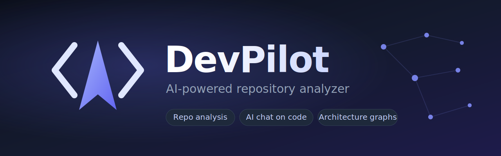

<p align="center">
  
</p>

<p align="center">
  <a href="https://github.com/s1rry/devpilot/actions/workflows/ci.yml"></a>
  <a href="LICENSE"></a>
  
  
  
</p>

**DevPilot** — десктоп-приложение, которое помогает понять любую кодовую базу. Откройте репозиторий, изучите его структуру, зависимости и качество кода, постройте интерактивные графы архитектуры — и задайте вопросы о коде обычным языком через AI-чат. Работает на Windows, macOS и Linux, а с локальной моделью (Ollama) — полностью офлайн, без единого запроса в облако.

Интерфейс двуязычный: **русский и английский**, переключается одной кнопкой в верхней панели. По умолчанию — русский.

> **Статус:** активная открытая разработка. Уже сейчас можно собрать из исходников (см. [Установка из исходников](#установка-из-исходников)). Готовые установщики в один клик — на подходе.

## Содержание

- [Возможности](#возможности)
- [Установка в один клик](#установка-в-один-клик)
- [Установка из исходников](#установка-из-исходников)
- [Как пользоваться](#как-пользоваться)
- [Настройка AI](#настройка-ai)
- [Архитектура](#архитектура)
- [Как помочь проекту](#как-помочь-проекту)
- [Лицензия](#лицензия)

## Возможности

- **Менеджер репозиториев** — откройте локальную папку или склонируйте репозиторий с GitHub по ссылке. Список недавних проектов, метаданные: ветка, число коммитов, размер, разбивка по языкам.
- **Сканер репозитория** — определяет языки, фреймворки и зависимости (npm, Cargo, PyPI, Go), структуру папок и контрибьюторов из истории git.
- **AST-анализатор** — разбор Rust и TypeScript/JavaScript через tree-sitter в структурную модель: функции, классы, интерфейсы, импорты и экспорты.
- **Графы архитектуры** — интерактивные графы зависимостей, модулей, папок и вызовов. Панорама, зум, перетаскивание узлов.
- **AI-чат** — разговор о вашем коде с потоковыми ответами: **Ollama** (локально, без ключа), **Claude**, **OpenAI** или **Gemini**. Markdown и подсветка блоков кода.
- **Инсайты (Code Intelligence)** — поиск циклических зависимостей, мёртвого кода и дублирования, а также поиск по коду («где аутентификация?») по символам и путям с передачей найденного в AI-чат для объяснения.

Весь анализ **детерминированный и локальный**; AI подключается по желанию и не привязан к одному провайдеру. **API-ключи хранятся только на вашей машине.**

## Установка в один клик

> Готовые установщики выпускаются на странице [**Releases**](https://github.com/s1rry/devpilot/releases). Раздел готовится — до первого релиза используйте [установку из исходников](#установка-из-исходников).

Когда релизы появятся, установка будет такой:

| ОС | Файл | Как поставить |
|---|---|---|
| **Windows** | `DevPilot_*_x64-setup.exe` (или `.msi`) | Скачать, запустить, «Далее» — готово. |
| **macOS** | `DevPilot_*_universal.dmg` | Открыть образ, перетащить DevPilot в «Программы». |
| **Linux** | `DevPilot_*_amd64.AppImage` | Сделать исполняемым (`chmod +x`) и запустить. Также будут `.deb`. |

Приложение не требует прав администратора и работает автономно.

## Установка из исходников

Это рабочий способ на сегодня.

**Что нужно заранее:** [Rust (stable)](https://rustup.rs), [Node.js 20+](https://nodejs.org), [pnpm](https://pnpm.io) и [системные зависимости Tauri](https://tauri.app/start/prerequisites/) для вашей ОС.

```sh
git clone https://github.com/s1rry/devpilot.git
cd devpilot/apps/desktop
pnpm install
pnpm tauri dev
```

Первый запуск компилирует Rust-часть — это занимает несколько минут. Дальше приложение открывается своим окном.

Чтобы собрать установщик под свою ОС локально:

```sh
pnpm tauri build
```

Готовый пакет появится в `apps/desktop/src-tauri/target/release/bundle/`.

## Как пользоваться

Интерфейс — боковая панель слева (шесть разделов), верхняя панель с переключателями темы и языка, статус-строка снизу.

1. **Репозиторий.** Нажмите **«Открыть папку»** и выберите проект, либо вставьте ссылку на GitHub и нажмите **«Клонировать»**. Появятся метаданные проекта, а сам он сохранится в списке недавних.
2. **Анализ.** Нажмите **«Сканировать папку»** — DevPilot определит языки, фреймворки, зависимости, структуру и историю git и покажет наглядный отчёт.
3. **Архитектура.** Выберите проект и нажмите **«Анализировать»**. Переключайтесь между графами (Зависимости / Модули / Папки / Вызовы). Узлы можно тянуть, колесо мыши — зум, перетаскивание фона — панорама.
4. **AI-чат.** Выберите проект, задайте вопрос о коде. Ответ приходит потоком, с Markdown и подсветкой кода. Провайдер и модель настраиваются в разделе «Настройки».
5. **Инсайты.** Нажмите **«Анализировать»**, чтобы найти циклические зависимости, мёртвый код и дублирование. Строка поиска отвечает на вопросы вроде «где инициализируется база данных?»; у каждого результата есть кнопка **«Объяснить»** — она передаёт символ в AI-чат.
6. **Настройки.** Выбор AI-провайдера, модели и ввод API-ключа (см. ниже).

Тема (тёмная/светлая) и язык (RU/EN) переключаются кнопками в верхней панели и запоминаются между запусками.

## Настройка AI

Откройте **«Настройки»** и выберите провайдера:

- **Ollama** — локально, **без API-ключа**. Установите [Ollama](https://ollama.com) и загрузите модель, например `ollama pull llama3`. Полностью офлайн, ничего не уходит в облако.
- **Claude**, **OpenAI**, **Gemini** — вставьте свой API-ключ в поле настроек. Ключ хранится локально в папке данных приложения и **никогда не показывается в логах** (маскируется в отладочном выводе).

Укажите имя модели (например `llama3`, `claude-sonnet-4`, `gpt-4o`) и сохраните. После этого AI-чат готов к работе.

## Архитектура

Cargo-workspace по принципам Clean Architecture: все зависимости направлены внутрь, к `devpilot-core`, который описывает домен и порты (трейты), а крейты-адаптеры их реализуют. Подробнее — [ADR-0001](docs/adr/0001-clean-architecture-workspace.md).

| Путь | Назначение |
|---|---|
| `crates/devpilot-core` | Домен: сущности, порты, use-cases, чистые детекторы (графы, code intelligence). |
| `crates/devpilot-git` | Чтение репозитория через libgit2: открытие, клон, дерево файлов, история, churn. |
| `crates/devpilot-analysis` | Разбор кода в AST-модель через tree-sitter. |
| `crates/devpilot-scan` | Детекторы манифестов: языки, фреймворки, зависимости. |
| `crates/devpilot-ai` | Адаптеры LLM-провайдеров (Ollama, Claude, OpenAI, Gemini). |
| `crates/devpilot-storage` | Локальное хранение в JSON (недавние проекты, настройки). |
| `crates/devpilot-testing` | Общие моки и фикстуры. |
| `apps/desktop` | Оболочка Tauri (composition root) + UI на React/TypeScript/Tailwind. |

Ещё: [docs/architecture.md](docs/architecture.md) · Решения: [docs/adr](docs/adr) · Изменения: [CHANGELOG.md](CHANGELOG.md).

## Как помочь проекту

Контрибьюции приветствуются — проект молодой, и это лучшее время, чтобы влиять на его развитие. Начните с [CONTRIBUTING.md](CONTRIBUTING.md): там карта кодовой базы и примеры, как добавить провайдера, язык или новый срез функциональности.

## Лицензия

[MIT](LICENSE)
